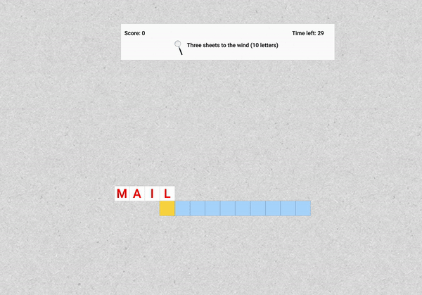

# AcrossWords

[AcrossWords](https://acrosswords.herokuapp.com/) is a variation on the classic Crosswords game. Players are provided with a clue and a limited amount of time to fill out as many words as they can.

### Technologies

- MongoDB
- Express.js
- React.js, Redux.js, React & React-Redux Hooks
- Node.js
- Styled Components
- Passport and JWT


## Some Key Features

- BCRYPT and JWT aided user authentication
- Almost 16,000 words and clues
- Database is queried in real time after every answer
- The next word is always generated such that it overlaps with one to three letters of the beginning or end of the previous word
- Player's score and time remaining adjust dynamically depending on the correctness of their answers
- Utilizes function components as well as React Hooks

## MongoDB Database

<!-- use ### for subsections within the MongoDB Databse section -->
<!--  -->
<!-- [Click here for more info](https://github.com/jacobprall/CrossWords/blob/f36ec37313de785ceb7e6a9bc92948aef588bf17/routes/api/route_helpers/game/patch/getNextWord.js#L48) -->
## Gameplay 


On our MongoDB database, we store game data (clues given and guesses made) and a users collection for authentication, as well as a collection of almost 16,000 words and clues drawn from New York Times crossword puzzles.

### Seeding clues

We created a parsing script to pull clues from the `.puz` format, then a seeding script to drop into our database.

### Indexing

Our variation of a crossword puzzle gives users a few "free" letters at either the beginning or end of a word. Naively, to search the database for clues that match either the first X letters or the last X letters (without other matching criteria) would result in a time complexity of O(n), which would be detrimental to the playing experience. The solution would be to add indexes and let MongoDB's query engine do the work for us. Normally, indexing several fields of a database would be ill-advised, since the index may need to be rotated/rebuilt when adding/updating records. However, since this collection was static, extra indexes only improve our performance at the expense of more time upfront to build them out.

We decided to add a couple fields to each document in the database (`prefixes` & `suffixes`) which were calculated in the seed script and include a list of substrings from the front and end of the clue's answer, respectively. Indexing on each, as well as `length` and `difficulty`, allow us to get O(log n) performance when fetching a selection of possible new clues. We then apply a little randomness to ensure that each game is unique.

## Gameplay


### Grid
* Presents one row at a time, aligning it with the previous row depending on the overlap between the new and old word
* Allows players to easily navigate through the input boxes using arrow keys
* Answers are colored in red and green to indicate correctness 


The length of the correct answer is given to the player by a series of blank `input` tags. No matter what answer is given, the following word will line up to either the front or end of the previous word guessed. To improve the dynamism of gameplay, we used a CSS grid to align the words in columns and rows. The starting column is calculated on the back end based on the previous answer, and is sent with the response, and then lined up on the board. CSS Grid proved easy to use and allowed things to flow well.

### Score, TimeElapsed, and Clue Components
*All values are fetched and adjusted in real time
*State is mantained using a custom useStateValue hook


<!-- if you want to add a gif, use the format below -->
<!--  -->
<!-- I added an images folder, add the gifs there. -->
<!-- example: -->
### Game Play Example: 


### Backend
* The Backend handles the majority of the game logic, including testing for correct answers and manipulating score and time remaining. 
* The Backend also handles all database queries, with the following code used to search for a clue with the proper overlap.
```javascript
/**
 * Get the overlap between two words and a vector from the beginning
 * or end of A.
 * @param {String} a "Old word" against which we test the
 * @param {String} b "New word"
 * @param {[Boolean]} oneTimeOnly Allows one recursive call to check the
 *                                reverse situation. Default false.
 * @returns {Integer} - Positive values indicate that word A lines up with the
 *                      first X characters of word B.
 *                      Negative values indicate that word B lines up
 *                      with the last X characters of A
 * @example getOverlap("PIZZA", "ZAP") === -2
 * @example getOverlap("ZAP", "PIZZA") === -1
 * @example getOverlap("BLAH", "AHA") === -2
 * @example getOverlap("BLAH", "CABLA") === 3
 */
const getOverlap = (a, b, oneTimeOnly = false) => {
  if (a.length === 0 || b.length === 0) return 0;


  let i = 0;
  const firstWordSuffix = a.slice(a.length - PREFERRED_OVERLAP);
  while (i < PREFERRED_OVERLAP) {
    const suffixSlice = firstWordSuffix.slice(i);
    const secondWordSlice = b.slice(0, PREFERRED_OVERLAP - i);
    if (suffixSlice === secondWordSlice) {
      const modifier = oneTimeOnly ? 1 : -1;
      return modifier * (PREFERRED_OVERLAP - i);
    }
    i += 1;
  }
  if (oneTimeOnly) return 0;
  return getOverlap(b, a, true);
};

```

* The addition of time is handled by a cubic algorithm that offers players diminishing time increases as the game continues.
```javascript
const MAX_TIME = 60;
const GAME_DURATION = 60;
const TIME_CONSTANT = 12;
const BASELINE_TIME_ADDITION = 7 / 6; // baseline time addition => ((7/6) - 1) * TIME_CONSTANT

const handleTime = (isCorrect, game) => {
  if (!isCorrect) {
    return 0;
  const { timeRemaining } = game;
  
  let { timeElapsed } = game;
  
  timeElapsed = Math.abs(timeElapsed);
  if (timeElapsed > GAME_DURATION) {
      timeElapsed = GAME_DURATION;
  }
  const normalizer = GAME_DURATION ** 3; // normalizer const => 60
  
  let timeAddition = Math.ceil(
    ((-1 * ((timeElapsed ** 3) / normalizer)) + BASELINE_TIME_ADDITION) * TIME_CONSTANT);
    // between (7/6 * 12) and (1/6 * 12)
  timeAddition = Math.floor(
    timeAddition * (Math.abs(1 - (timeRemaining / MAX_TIME)) + 1));

  return timeAddition;
};
```

